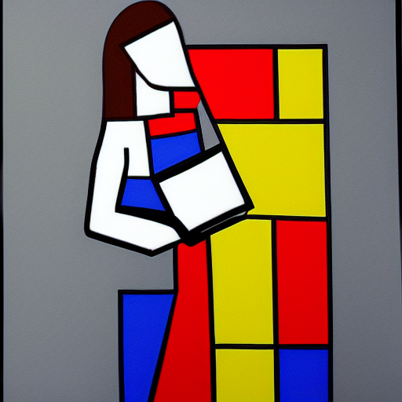

# Prompt Design

Prompt design is the art and science of creating a short descriptive text that is given to a language model.  Some systems such as OpenAI's GPT-3 also allow you to give a sequence of examples of what you would like returned.

In the future, 

## Example with GPT-3

Prompt:<br/>
```
Create an outline for a class on prompt design using large language models such as GPT-3.

1. What is prompt engineering
2. Designing prompts
3. Prompt length
4.
```

Results:<br/>

```
Prompt type
5. Prompt structure
6. Prompt content
7. Generating prompts with GPT-3
8. Evaluating prompts
```

## Prompts in Text to Image

Prompts in most text-to-image systems are limited to around 20 words.  They often have to parts:

1. The objects to be rendered
2. The style of rendering.  The styles frequently reference:
   1. An type of image (drawing, painting, photo, sketch, blueprint)
   2. The class of art (impressionism, surrealist)
   3. A specific painter (Vincent Van Goah, Dali)
   4. A specific painting (Daybreak by Maxfield Parrish)
   5. A series of adjectives of how you want the image rendered (bright, detailed)

One of the best ways to learn prompt design is to go to the stable diffusion search engine [Lexica](https://lexica.art/) and view the prompts that generate the art you are interested in.

## Understanding Context of a Style

Not all artists will render all objects.  For example, if you pick a painter that didn't do representational art, like [Mark Rothko](https://en.wikipedia.org/wiki/Mark_Rothko) or [Piet Mondriaan](https://en.wikipedia.org/wiki/Piet_Mondrian), and you give a prompt such as "Girl with laptop in the style of Mark Rothko" you will only get highly abstract art, but not a detailed person.


A girl with a laptop in the style of Mark Rothko


A girl with a laptop in the style of Piet Mondrian

In contrast, the artist [Rembrandt](https://en.wikipedia.org/wiki/Rembrandt) did many finely detailed drawings of people, so these images will come out in high detail:

![A girl with a laptop in the style of Rembrandt](../imga_girl_with_a_laptop_in_the_style_of_rembrandt.png
A girl with a laptop in the style of Rembrandt