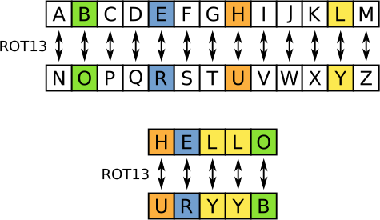

# ROT13 Encryption Games

ROT13 is a simple letter substitution cipher that replaces a letter with the 13th letter after it in the alphabet. ROT13 is a special case of the Caesar cipher which was developed in ancient Rome.

To do this activity, take a word or phrase and convert it into ROT13.  You can use a table or an encryption wheel.  Then give the message to a friend and ask them if they can decrypt it back into the original cleartext.

ROT13 Table from Wikipedia Commens taken from [here](https://en.wikipedia.org/wiki/ROT13#/media/File:ROT13_table_with_example.svg)

## References

[ROT13 running in a JavaScript web page](https://rot13.com/)

[Wikipedia Page](https://en.wikipedia.org/wiki/ROT13)