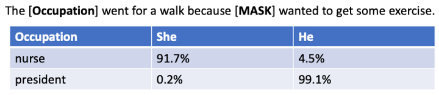

# Glossary of Terms for Text to Image Project

#### API Key
A key that is assigned to a developer to use a specific programming interface.  The key is used to associate billing with the service.

Many commercial text-to-image systems require the user to register with a credit card to get an API Key.  Images generated are billed to a credit card each month.

#### BERT

Bidirectional Encoder Representations from Transformers (BERT) is a [transformer](#transformer)-based machine learning technique for [natural language processing] (NLP) pre-training developed by Google.

* See also: [Wikipedia on BERT](https://en.wikipedia.org/wiki/BERT_(language_model))

#### Content
The information is conveyed by an image.  For example, the mood, the message, or the story.

#### Deep Neural Network

A type of [neural network](#neural-network) with multiple layers between the input and output layers.

See also: [Wikipedia on DNN](https://en.wikipedia.org/wiki/Deep_learning#Deep_neural_networks)

#### Domain

The subject matter or context of an image.  For example, a landscape, a portrait, a still life, or an abstract image.

#### Embedding
A vector of scalar numbers used to map a word or phrase into the mathematical structure for comparison using distance measurements.

#### Fine Tuning
The process of adding a small additional output layer to an existing model to give specific results.  

For example, diagrams that need to conform to Optum 2022 color themes would need to fine-tune a basic model.

#### Gender Bias

The tendency of machine learning models to favor one gender or another for specific situations.  The most common of these is occupations or roles.  For example, the BERT large language model generates an 83% chance that a "nurse" will be female, but only a 

* See also: [Showing Bias in BERT](https://dmccreary.medium.com/showing-bias-in-bert-475e98dabf51)

#### Generative Adversarial Network

A neural network architecture used for image generation that uses dueling neural networks to genrate and judge the quality of images.

* Also known as: GAN

#### Perceptual loss

A loss function used in image generation that measures the difference between two images in a way that is perceptually meaningful to humans.

#### Generative Model

A machine learning model used to generate images from text descriptions.

#### HuggingFace

The largest collection of machine learning models and tools to fine-tune these models.  As of August 2022, HuggingFace has 28 image to text models.

* See [HuggingFace Text to Image Models](https://huggingface.co/models?pipeline_tag=text-to-image&sort=downloads)

#### Image synthesis

The process of creating a new image from a set of input images.

#### Multi-model Models

Models that convert one medium into another medium.  

For example text-to-image, image-to-text, speech-to-text, text-to-speech etc.  Many of the models can be fine-tuned to generate other representations such as text-to-line-art or text-to-architecture-diagram.

#### Texture synthesis

The process of creating a texture from a set of input textures

#### Neural Network

A machine learning model composed of a large number of interconnected processing nodes, or neurons, that can learn to recognize patterns of input data.

Text-to-image models almost all use deep neural networks that contain millions or billions of parameters.

#### Max Tokens
The maximum number of tokens used by a prompt.  After this limit is reached the text is ignored.

The max-tokens for standard language models such as BERT are usually 512 tokens.  Larger models such as GPT-3 are 2K or 4K tokens.

#### Style

The style used to render an image.  For example, a photo, a cartoon, a wireframe, a sketch, line art, a painter or a painting.

Prompts that desire a specific style can add the suffix such as "in the style of..."

#### Style Transfer

The process of creating an image in the style of another style, artist, image or type of image.  For example, "A cat in a field in the style of Vincent Van Goh"

#### Stable Diffusion

The most popular text-to-image model on HuggingFace.

* See [HuggingFace](https://huggingface.co/CompVis/stable-diffusion-v1-4)

#### Training Bias

The training data used to train a machine learning model.  This data can influence the results of the model.

#### Prompt

The descriptive text that is given to generate an image.

#### Text to Image

The process of generating images from a text description using large langauge models.

#### Tokenization

The way that descriptive text is converted into a sequence of numeric values.  Small common words are usually a single token.  Uncommon multi-syllable words are often many tokens.

<!--
## Sample GPT Prompt
Generate a glossary of terms for an text-to-image project.  For each term, give the definition using a precise, concise, distinct definition that is free of rules.

1. Text-to-image - algorithms that convert textual descriptions into images
2. Deep neural network: a neural network with input, output and at least one hidden layer
3. Style transfer: the process of creating an image in the style of another image
-->